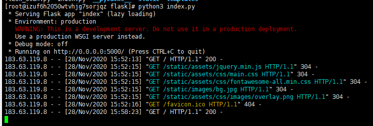
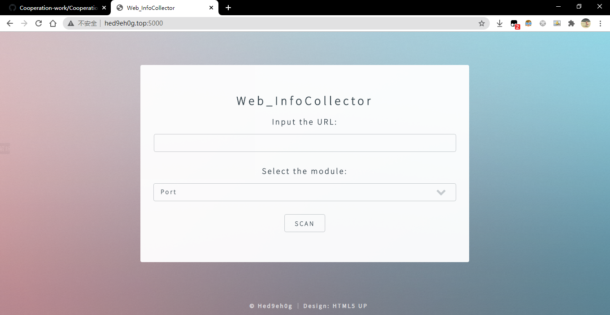
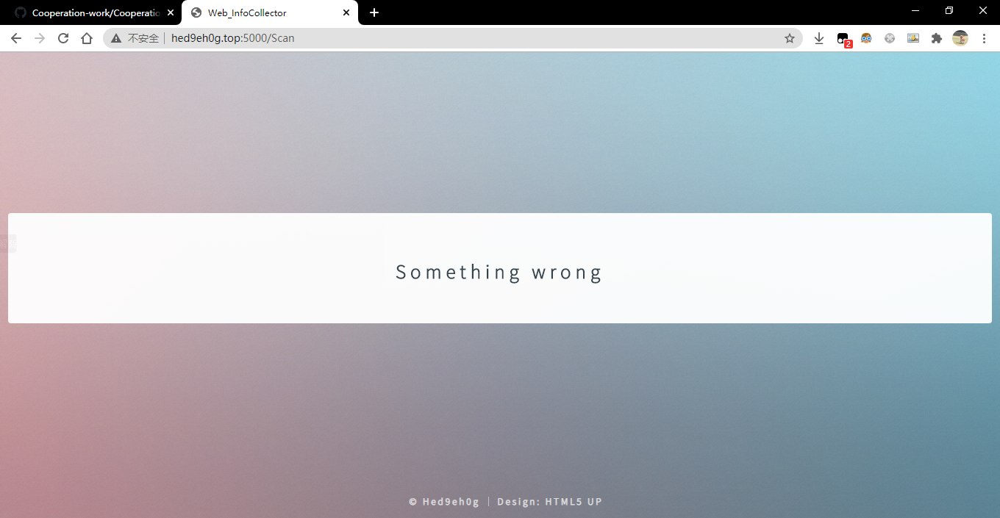
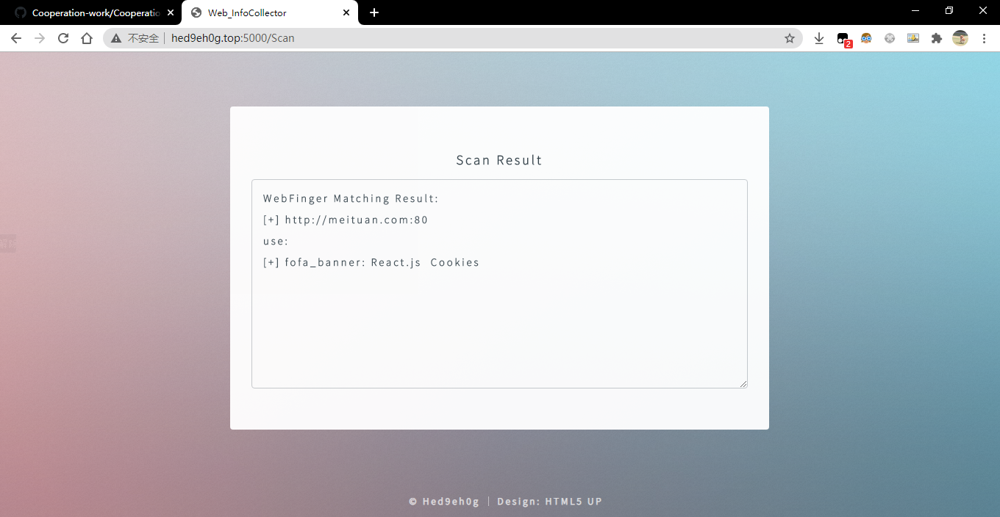
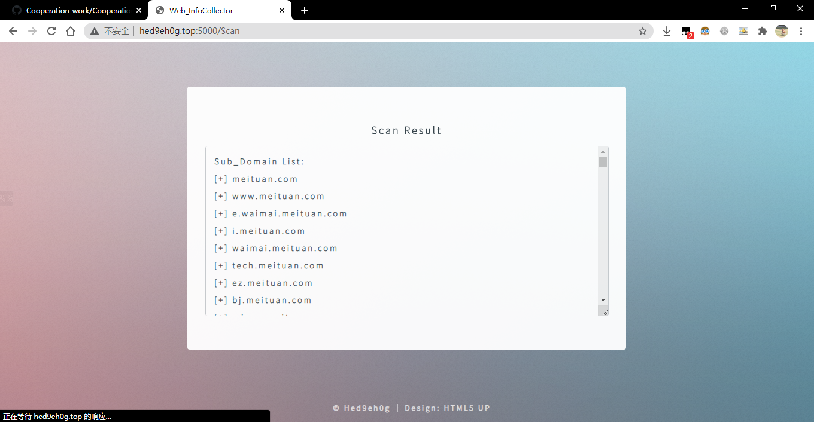
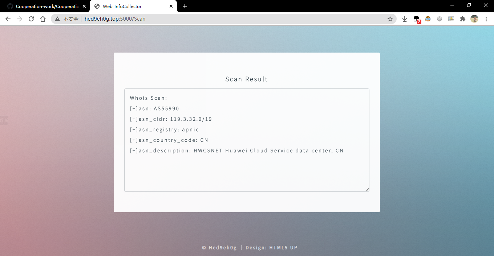
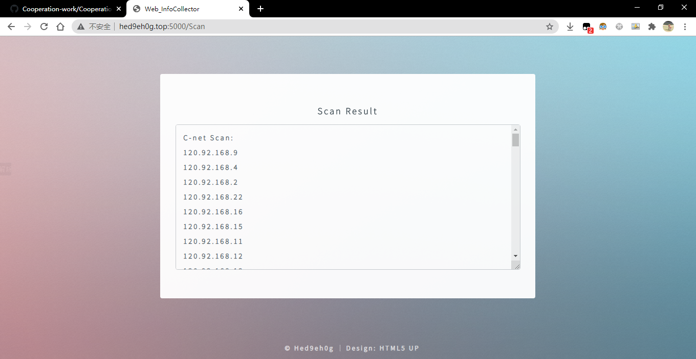

## 运行环境

- 语言：python 3

- 服务器：Cent OS
- python包：参见requirements.txt


## 使用

1、安装所需包：

```powershell
pip freeze >requirements.txt
```

2、执行flask目录下的`index.py`：

```powershell
python3 index.py
```

后台：




网页访问（index.html界面）：




报错界面：




#### Port模块（检测端口是否开放）

键入URL，点击按钮，在弹窗中指定起始端口为1和结束端口为100，运行结果：


#### CMS模块（检测使用CMS类型）

键入URL，点击按钮，在弹窗中指定起始端口为1和结束端口为100，运行结果：




#### CDN Waf模块（检测使用Waf类型）

键入URL，点击按钮，在弹窗中指定起始端口为1和结束端口为100，运行结果：


#### Sub Domain模块（扫描子域名）

键入URL，点击按钮，运行结果：




#### Whois模块（查询Whois服务类型）

键入URL，点击按钮，运行结果：




#### IP C_net模块（扫描C段地址）

键入URL，点击按钮，运行结果：




#### All模块（执行以上所有模块，输出全部结果）

